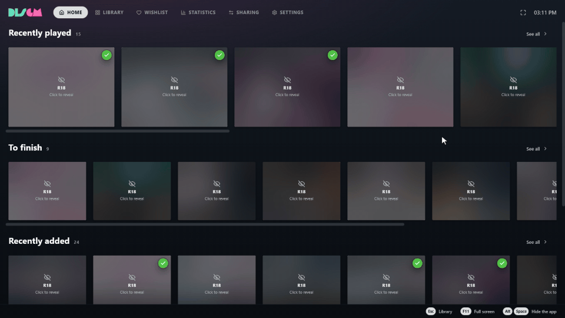
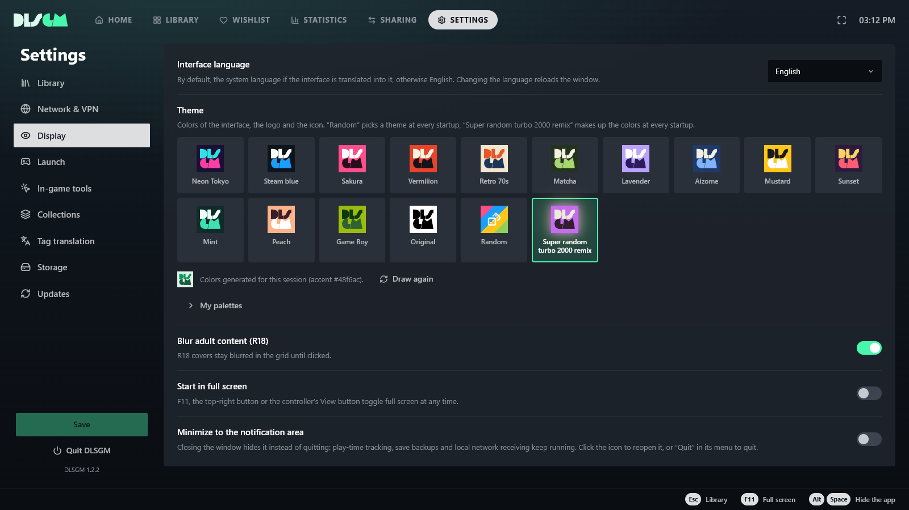

<div align="center">


<h3>Your DLsite games, finally gathered inside a real library.</h3>

One place to play them all. </br>
Drop your games in a folder: DLSGM finds them, fetches their covers and details.

<a href="https://github.com/Matty-H/DLSGM/releases/latest"></a>

<picture>
  <source media="(prefers-color-scheme: dark)" srcset="docs/badges/windows-dark.svg">
  
</picture>
&nbsp;
<picture>
  <source media="(prefers-color-scheme: dark)" srcset="docs/badges/macos-dark.svg">
  
</picture>

<br>



<sub>Adult covers stay blurred until you click them.</sub>

</div>

<br>

<table>
  <tr>
    <td width="33%" valign="top">
      <h3>📚 Automatic completion</h3>
      <p>Every title gets its cover, circle, tags and screenshots from DLsite, in Japanese and English. Even if a work leaves DLsite, its page stays with you.</p>
    </td>
    <td width="33%" valign="top">
      <h3>▶️ Play and save however you want</h3>
      <p>Play in one click, exactly how you like it. Need launch arguments? Done. Looking for your saves? Done. Patch and translate? Done.</p>
    </td>
  </tr>
  <tr>
    <td width="33%" valign="top">
      <h3>🎮 Tools while you play</h3>
      <p>On Windows: an overlay on top of the game (Shift+Tab), screenshots of the game window, and the meaning of every Japanese word on screen, with furigana, offline.</p>
    </td>
    <td width="33%" valign="top">
      <h3>🤫 No panic, there's a panic button!</h3>
      <p><b>Alt+Space</b> hides DLSGM instantly; on Windows, a second shortcut minimizes every window and mutes audio. Adult covers stay blurred in the library, and everything else stays on your computer: no account, no cloud.</p>
    </td>
  </tr>
</table>

## Make it yours

**14 built-in color palettes.** Pick one. If nothing fits, create your own palette.

<table>
  <tr>
    <td width="50%"></td>
    <td width="50%"></td>
  </tr>
  <tr>
    <td align="center"><sub><b>14 color palettes</b>, your own, or brand-new colors at every startup with our patented <i><b>Super Random Turbo 2000 Remix technology</b> (it's just a randomizer)</i></sub></td>
    <td align="center"><sub><b>In-game tools</b>, set up in a few clicks</sub></td>
  </tr>
</table>

DLSGM speaks **English, French and Japanese** and follows your system language. [Translating it](TRANSLATING.md) takes one file.

## Installation

1. Open the [download page](https://github.com/Matty-H/DLSGM/releases/latest).
2. Pick your file:

   | You are on… | Download | |
   |---|---|---|
   | Windows | `DLSGM-…-Windows-Installeur.exe` | Recommended: Installed version allowing auto-update |
   | Windows, without installing | `DLSGM-…-Windows-Portable.exe` | Runs directly, update it yourself |
   | Mac (Apple Silicon) | `DLSGM-…-macOS-arm64.dmg` | Drag DLSGM into Applications |

   The other files on the page are used for updates: no need to download them.
3. Launch DLSGM and choose the folder that contains your games in the Settings.

### Organizing your games

DLSGM recognizes a game by its DLsite number. Each game needs its own folder, named exactly after that number, inside your games folder:

```
My games/
├── RJ01234567/
├── RJ123456/
└── VJ01000000/
```

The number is in the URL of the game's DLsite page. `https://www.dlsite.com/<category>/work/=/product_id/[GAME_ID].html`. If your folders have names like `[RJ01234567] Title v1.2`, DLSGM offers to rename them for you.

## FAQ

<details>
<summary><b>Windows shows “Windows protected your PC”.</b></summary>
<br>
DLSGM is not signed with a paid certificate, which triggers this warning. Click “More info”, then “Run anyway”.
</details>

<details>
<summary><b>My Mac refuses to open the app.</b></summary>
<br>
Right-click DLSGM in Applications, choose “Open”, then confirm. On recent macOS versions, go to System Settings › Privacy & Security and click “Open Anyway”.
</details>

<details>
<summary><b>A game has no details.</b></summary>
<br>
Some works are only visible on DLsite from Japan. Try again with a VPN set to Japan: the page will be filled in on the next scan.
</details>

<details>
<summary><b>How do I get the Japanese reading help?</b></summary>
<br>
Download the dictionary once in Settings › In-game tools; it then works offline. Windows must also be able to read Japanese text: Windows Settings › Time & language › Language › Add a language › Japanese (optical character recognition is enough). DLSGM tells you if it's missing.
</details>

<details>
<summary><b>How do I update DLSGM?</b></summary>
<br>
With the Windows installer, DLSGM tells you when a new version is out and installs it if you agree. The check can be turned off or run by hand in Settings › Updates. The portable version and macOS tell you too, but you download the new version yourself — on macOS, DLSGM isn't signed with a paid Apple certificate, so it can't install updates automatically.
</details>

<details>
<summary><b>How do I change the language?</b></summary>
<br>
Settings › Display › Interface language. Tags can be shown in English or in the original Japanese (Settings › Library › Tag language).
</details>

<details>
<summary><b>Is my data sent anywhere?</b></summary>
<br>
No. Your library, ratings and play time stay on your computer. DLSGM only contacts DLsite (for game details and pictures) and GitHub (for updates). If you choose an online translation service, only the text to translate is sent to it.
</details>

<details>
<summary><b>I want to report a problem or suggest an idea.</b></summary>
<br>
Open a ticket in the <a href="https://github.com/Matty-H/DLSGM/issues">Issues</a> tab.
</details>

---

<div align="center">

DLSGM is free, under the [CC BY-NC-SA 4.0](https://creativecommons.org/licenses/by-nc-sa/4.0/) license: you can share and modify it, but not sell it.

DLSGM is not affiliated with or endorsed by DLsite.

Want to translate DLSGM? See the [translating guide](TRANSLATING.md).</br>
Are you a developer? See the [contributing guide](CONTRIBUTING.md).

</div>
