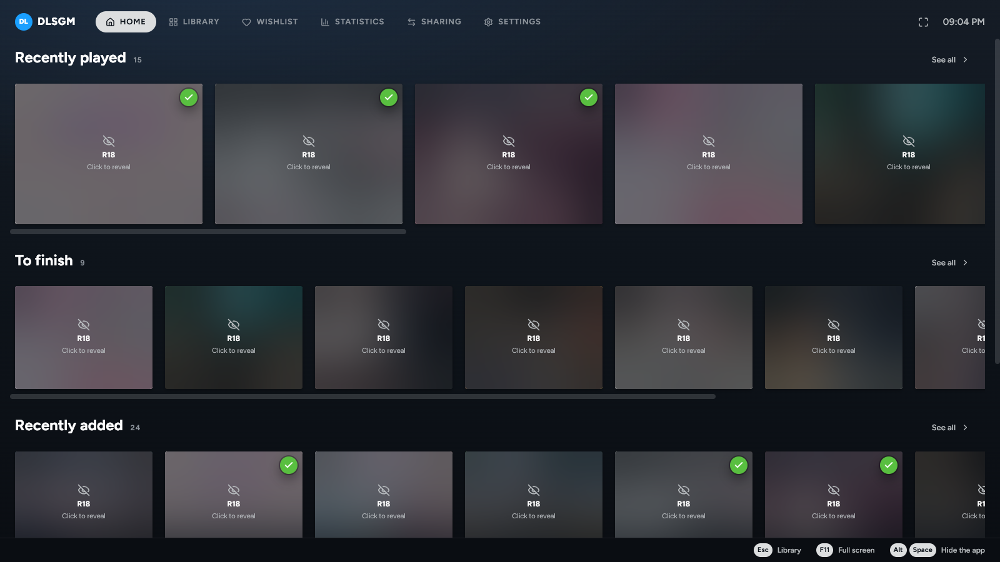
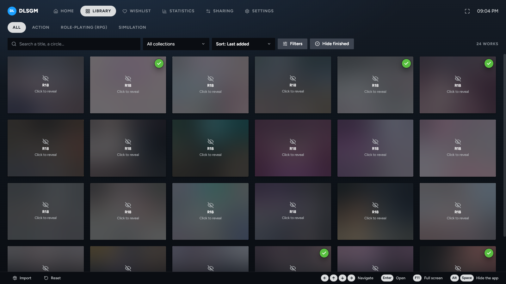
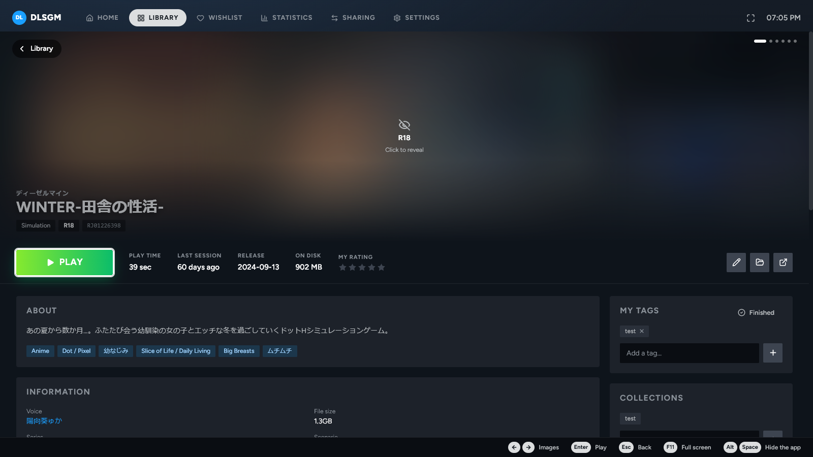
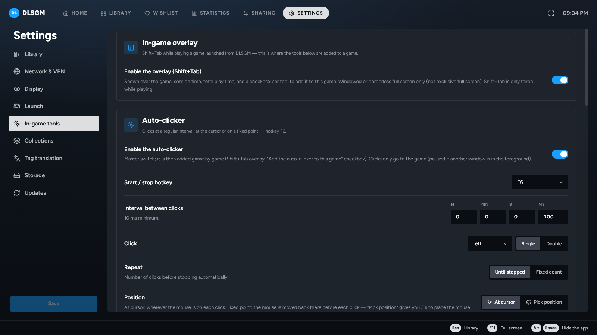

<div align="center">

# DLSGM

**Your DLsite library, finally organized.**

All your DLsite games in one place, with their covers, details and play time.
Launch them in one click, with a mouse, a keyboard or a controller.

[](https://github.com/Matty-H/DLSGM/releases/latest)


<br>



</div>

<table>
  <tr>
    <td width="50%"></td>
    <td width="50%"></td>
  </tr>
  <tr>
    <td align="center"><sub>The library, with R18 content blurred</sub></td>
    <td align="center"><sub>Every game gets its own page: play time, tags, rating and collections</sub></td>
  </tr>
  <tr>
    <td colspan="2"></td>
  </tr>
  <tr>
    <td colspan="2" align="center"><sub>In-game tools, set up in a few clicks</sub></td>
  </tr>
</table>

---

## Why DLSGM?

Are your DLsite games piling up in folders with cryptic names like `RJ01234567`, with no picture or description? DLSGM recognizes them automatically, fetches their details from DLsite and shows them in a clean library inspired by game consoles.

Everything stays on your computer: no account, no cloud.

---

## What DLSGM does for you

### A library that fills itself
Point DLSGM to the folder where your games are: it finds each title, its circle, tags, release date, cover and screenshots. Even if a work disappears from DLsite one day, its page stays with you.

### Find the right game in seconds
Search, filter by tag, circle or type, sort by date, play time or size on disk. Sort your games into collections, or let DLSGM fill them based on your own rules. The home screen shows what you haven't finished yet.

### Just play
One click to launch. DLSGM tracks your play time, backs up your saves every time you close a game, and lets you go back to an earlier save if something goes wrong.

### Hassle-free installs
Drop a downloaded archive (`.zip`, `.rar`, `.7z`): DLSGM extracts it to the right place, handles Japanese file names and tries the usual passwords. You can also send a game to another PC at home.

### Tools while you play *(Windows)*
- **Overlay** on top of the game (Shift+Tab): play time, screenshots and tools, without leaving the game.
- **Screenshots** of the game window only (Ctrl+F8), sorted by game.
- **Japanese reading help** (F10): the meaning of each word and kanji shown on screen, with furigana readings, offline.
- **Launch in Japanese locale** and **sandboxed launch**, for the games that need them.
- **Auto-clicker** and **macro recorder**, enabled only for the games you choose.

### Discreet when needed
**Alt+Space** hides DLSGM instantly. Adult covers can be blurred in the library.

### In your language
The interface is available in English, French and Japanese, and follows your system language by default.

---

## Installation

1. Open the [download page](https://github.com/Matty-H/DLSGM/releases/latest).
2. Pick your file:

   | You are on… | Download | |
   |---|---|---|
   | Windows | `DLSGM-…-Windows-Installeur.exe` | Recommended: DLSGM will offer you its new versions |
   | Windows, without installing | `DLSGM-…-Windows-Portable.exe` | Runs directly, update it yourself |
   | Mac (Apple Silicon) | `DLSGM-…-macOS-arm64.dmg` | Drag DLSGM into Applications |

   The other files on the page are used for updates: no need to download them.
3. Launch DLSGM and choose the folder that contains your games in the Settings.

---

## Organizing your games

DLSGM recognizes a game by its DLsite number. Each game needs its own folder, named exactly after that number, inside your games folder:

```
My games/
├── RJ01234567/
├── RJ123456/
└── VJ01000000/
```

The number is in the address of the game's DLsite page. If your folders have names like `[RJ01234567] Title v1.2`, DLSGM offers to rename them for you.

---

## FAQ

**Windows shows “Windows protected your PC”.**
DLSGM is not signed with a paid certificate, which triggers this warning. Click “More info”, then “Run anyway”.

**My Mac refuses to open the app.**
Right-click DLSGM in Applications, choose “Open”, then confirm. On recent macOS versions, go to System Settings › Privacy & Security and click “Open Anyway”.

**A game has no details.**
Some works are only visible on DLsite from Japan. Try again with a VPN set to Japan: the page will be filled in on the next scan.

**How do I update DLSGM?**
With the installer, DLSGM tells you when a new version is out and installs it if you agree. The check can be turned off or run by hand in Settings › Updates. The portable version tells you too, but you download the new version yourself.

**How do I change the language?**
Settings › Display › Interface language. Tags can be shown in English or in the original Japanese (Settings › Library › Tag language).

**Is my data sent anywhere?**
No. Your library, ratings and play time stay on your computer. DLSGM only contacts DLsite (for game details and pictures) and GitHub (for updates). If you choose an online translation service, only the text to translate is sent to it.

**I want to report a problem or suggest an idea.**
Open a ticket in the [Issues](https://github.com/Matty-H/DLSGM/issues) tab.

---

<div align="center">

DLSGM is free, under the [CC BY-NC-SA 4.0](https://creativecommons.org/licenses/by-nc-sa/4.0/) license: you can share and modify it, but not sell it.

DLSGM is not affiliated with or endorsed by DLsite.

Are you a developer? See the [contributing guide](CONTRIBUTING.md).

</div>
